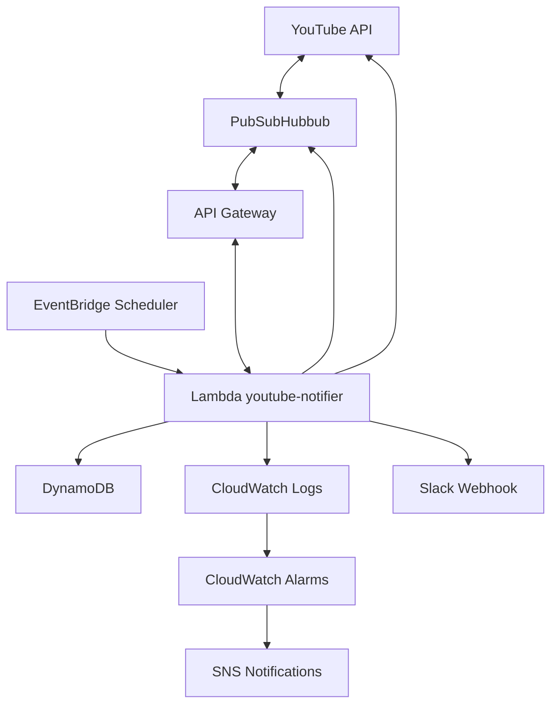

# YouTube Notifier Terraform

AWS 上に YouTube 通知システムをデプロイするための Terraform プロジェクト。
YouTube チャンネルの更新を Webhook で受け取り、Slack 通知を行うサーバーレスアプリケーションです。

## システム構成図



## コンポーネント

1. **Lambda Function (youtube-notifier)**

   - Youtube API からユーザがサブスクライブしているチャンネルを取得し、Pubsubhubbub にチャンネルの topic のサブスクライブ（解除）のリクエストを送信
   - Pubsubhubbub からの通知を基に、YouTube API から新着の動画・ライブ情報を取得して Slack に通知

2. **API Gateway**

   - YouTube からの Webhook 通知を受信し、Lambda 関数を呼び出す

3. **EventBridge Scheduler**

   - 定期的に Lambda 関数を呼び出し、対象チャンネルの topic へのサブスクライブ追加・更新・解除を行う

4. **DynamoDB**

   - チャンネルの最終更新時間・topic へのサブスクライブ失効時間を管理

5. **CloudWatch アラーム**

   - エラー・警告ログを監視

6. **SNS**
   - アラート通知を配信

## 設定手順

### 1. YouTube API の認証情報を設定

- [ドキュメント](https://developers.google.com/youtube/v3/quickstart/nodejs?hl=ja)を参考に、クレデンシャルファイルとトークンファイルを生成

- `lambda/youtube-notifier/credentials` ディレクトリ内に `credentials.json` , `token.json` という名前で配置

### 2. 設定ファイルの作成

- `lambda/youtube-notifier/config/config.json` を作成

  - `exclude_words` (`list`): 動画タイトルに含まれていた場合に、通知対象から除外するワード一覧

  （例）

  ```json
  {
    "exclude_words": ["#shorts"]
  }
  ```

- ルートディレクトリ配下に `terraform.tfvars` を作成

  - `slack_webhook_url` (`str`): 通知先の Slack Webhook URL
  - `alert_email` (`str`): アラート発生時の送信先メールアドレス

  （例）

  ```hcl
  slack_webhook_url = "https://hooks.slack.com/services/YOUR/WEBHOOK/URL"

  alert_email = "your-email@example.com"
  ```

## デプロイ

1. Terraform を初期化

```bash
terraform init
```

2. デプロイを実行

```bash
terraform apply
```
